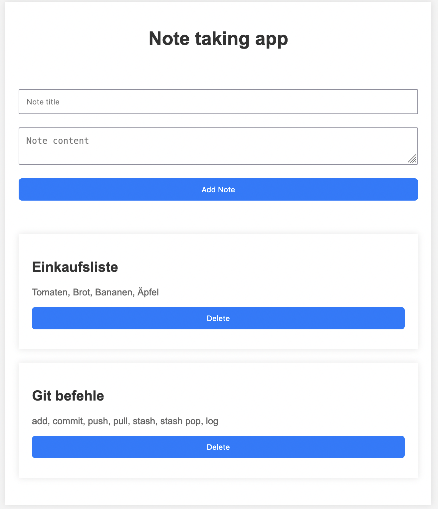

# Notizapp

[Notiz-App](https://notiz-app-aufgabe-mit-context-api.vercel.app/)

## Screenshot



## Funktionen

- Erstelle neue Notizen, indem du einen Titel und den Text der Notiz eingibst.
- Lösche unerwünschte Notizen, wenn du sie nicht mehr benötigst.
- Die Notizen werden automatisch gespeichert und bleiben erhalten, auch wenn du die Seite schließt oder das Gerät neu startest.

## Installation

1. Stelle sicher, dass du Node.js auf deinem System installiert hast.
2. Clone das Repository auf deinen lokalen Computer:

   ```bash
   git clone https://github.com/dein-benutzername/notiz-app.git

3. Navigiere in das Projektverzeichnis:

    ```bash
    cd notiz-app

4. Installiere die Abhängigkeiten:

    ```bash
    npm install

5. Starte die Anwendung:
    ```bash
    npm run dev

6. Öffne deinen Webbrowser und gehe zur URL http://localhost:5174/, um die Notiz-App zu verwenden.


## Technologien
- HTML
- CSS
- Javascript
- Vite-React

## Autor
- Leotrim Behrami - [Github-Profil](https://github.com/Leotrimbehrami)
